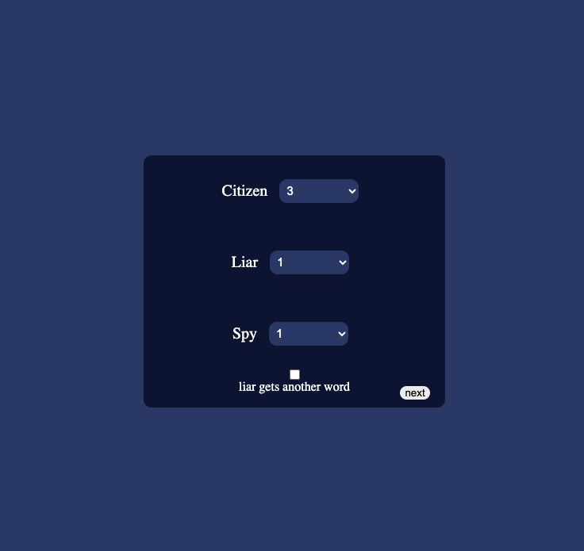
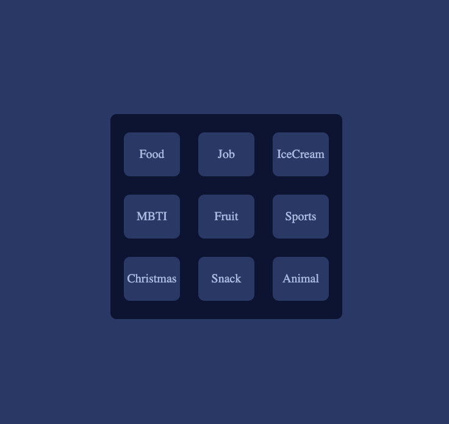
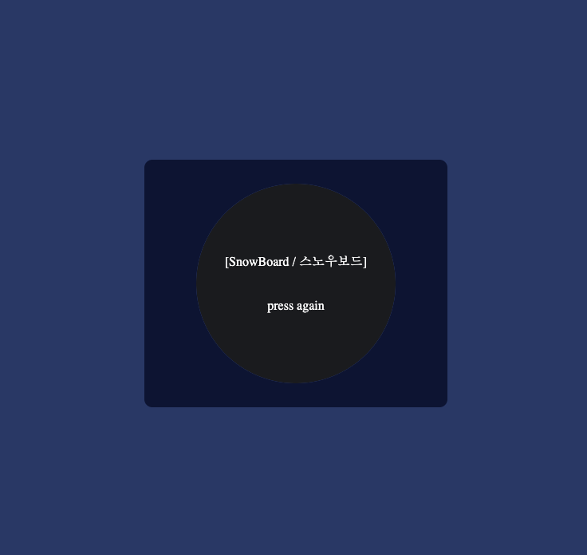
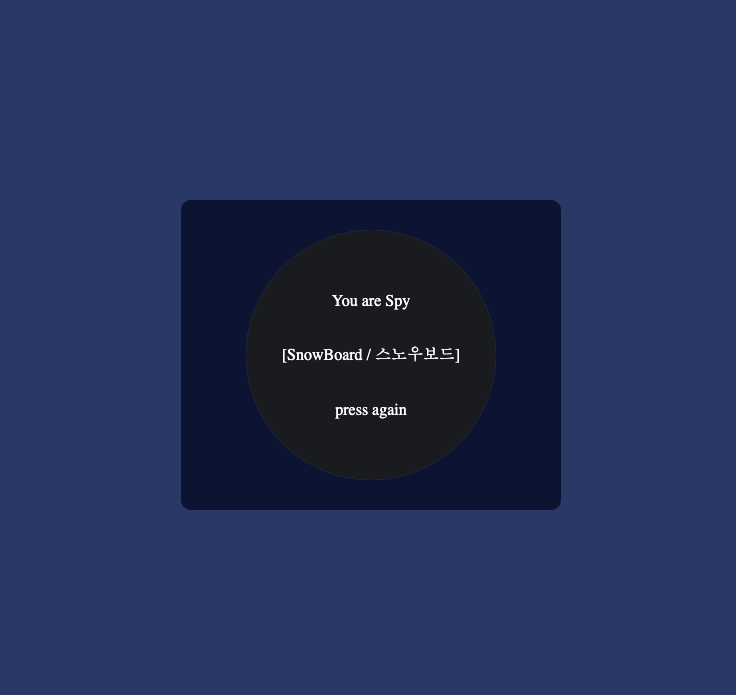
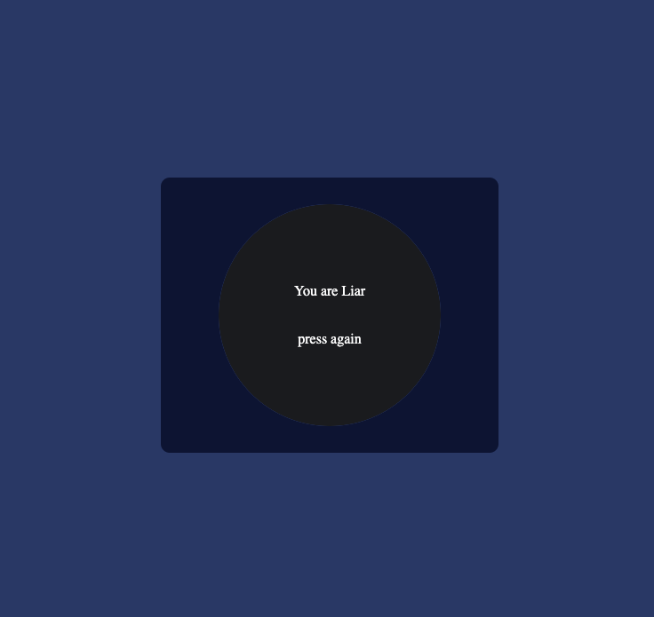
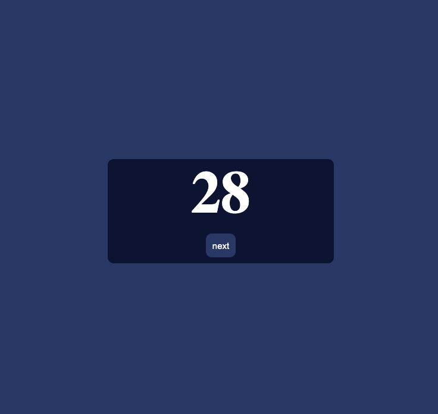

### Tech
- HTML
- CSS
- JavaScript

### Features
- Get the number of players from the user and set the number for each role
- Randomly ordered, each player can check the word on the screen except liar
- Implemented a press-and-hold feature to prevent mis-touches
- 30 seconds were given to discribe

#### You can select the number of players.
#### Spy is team with liar, and he has to describe a word clearly so that liar can tell what the word is.
#### If you check the checkbox, only liar gets another word, which mean liar doesn't know he is liar(No spy).

#### Several topics
##### (will be added some more)

#### Screen before check the word

#### Citizen screen

#### Spy screen

#### Liar screen

#### 30 seconds given to describe.

